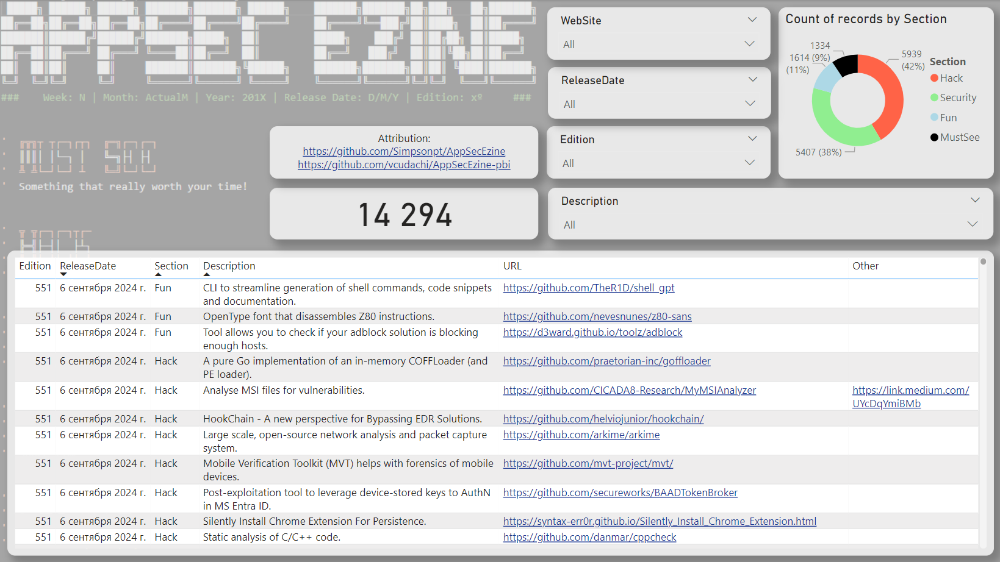

# AppSec Ezine PowerBI Report
Original content is located here: https://github.com/Simpsonpt/AppSecEzine

## Contents
1. **AppSecEzine-pbi.pbix** - PowerBI report.
2. **AppSecEzine-pbi.json** - Structured data in JSON format.
3. **AppSecEzine-pbi_MakeJSON.ps1** - Simple parser is used to make JSON file.

## Requirements
- Windows
- git
- Powershell 7.4
- PowerBI Desktop Application

## The reason and refresh instructions
The reason i made this Power BI report for AppSec Ezine is to be able to search for topics that interest me in a more structured manner. PBIX file contais AppSecEzines from the beginning to the date of PBIX file upload. 
In case you want to update the contents of the file, then you need to:
1. Simply using **git** clone the **AppSecEzine** folder next to **AppSecEzine-pbi_MakeJSON.ps1**
2. Run my simple parser for the data: **AppSecEzine-pbi_MakeJSON.ps1** to update the JSON file.
3. The next step is to correctly pass JSON file into the PowerBI report and refresh it. Open report in PowerBI Desktop application and use **"Transform data\Advanced Editor"** to change the location of the JSON file (Replace ***Source = Json.Document(File.Contents("C:\Temp\AppSecEzine-pbi\AppSecEzine-pbi.json")),*** with correct path).
4. Refresh the report

```Powershell
git clone https://github.com/vcudachi/AppSecEzine-pbi.git
cd AppSecEzine-pbi
git clone 'https://github.com/Simpsonpt/AppSecEzine.git'
. .\AppSecEzine-pbi_MakeJSON.ps1
```


**Screenshot**



**License:**

This project is under Creative Commons Attribution NonCommercial ShareAlike ([CC-NC-SA](https://creativecommons.org/licenses/by-nc-sa/3.0/ "CC-NC-SA")).

